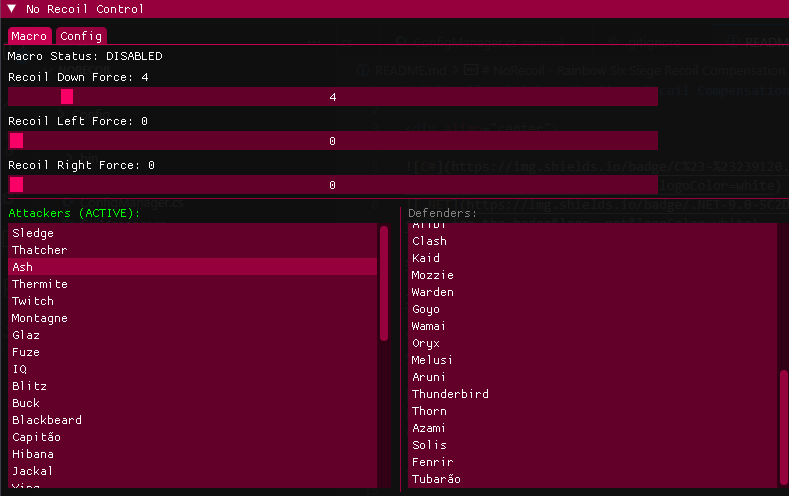

# NoRecoil - Rainbow Six Siege Recoil Compensation Tool

<div align="center">
  


**Built for players: customize Rainbow Six Siege recoil your way!**

[Features](#-features) • [Installation](#-installation) • [How to Use](#-how-to-use) • [Configuration](#-configuration) 

</div>

---

## 🌟 Features



### 🎮 **Per-Operator Recoil Customization**
- 35 attackers and 33 defenders, each with their own settings
- Automatic operator switching
- Fine-tune for every operator

### ⚙️ **Advanced Configuration**
- Everything saved automatically
- Global hotkeys
- JSON config files

### 🔧 **Precise Control**
- Adjust vertical and horizontal recoil force
- Smooth, accurate movement
- Change settings while you play

---

## 🚀 Installation

### Requirements
- Windows 10/11 (64-bit)
- .NET 9.0 Runtime (included in self-contained build)
- Running as administrator is recommended for input simulation

### Using Installer
- Download [No Recoil R6 Installer](https://github.com/Halqq/NoRecoil-Macro/releases)
- Run as Administrator 
- This will create a desktop shortcut 
- Run Shortcut and enjoy!

---

## 💻 How to Use

1. Launch the program – the overlay will show up
2. Press **Right Shift** (default keybind) to open the menu
3. Pick your operator
4. Adjust recoil values with the sliders:
   - **Down Force**: Compensates vertical recoil
   - **Left/Right Force**: Compensates horizontal recoil
5. Press Left and Right mouse buttons and have macro working!
6. Enable the macro and have fun!


### Supported Operators

<details>
<summary><b>🔴 Attackers (35)</b></summary>

- Sledge, Thatcher, Ash, Thermite, Twitch, Montagne, Glaz, Fuze
- IQ, Blitz, Buck, Blackbeard, Capitão, Hibana, Jackal, Ying
- Zofia, Dokkaebi, Lion, Finka, Maverick, Nomad, Gridlock, Nokk
- Amaru, Kali, Iana, Ace, Zero, Flores, Osa, Sens, Grim, Brava, Ram

</details>

<details>
<summary><b>🔵 Defenders (33)</b></summary>

- Smoke, Mute, Castle, Pulse, Doc, Rook, Kapkan, Tachanka
- Jäger, Bandit, Frost, Valkyrie, Caveira, Echo, Mira, Lesion
- Ela, Vigil, Maestro, Alibi, Clash, Kaid, Mozzie, Warden
- Goyo, Wamai, Oryx, Melusi, Aruni, Thunderbird, Thorn, Azami, Solis, Fenrir, Tubarão

</details>

---

## ⚙️ Configuration

Config files are stored in `%USERPROFILE%\Documents\NoRecoil\`:

- `macro_config.json` – Per-operator recoil settings
- `app_config.json` – General preferences and hotkeys

Example config:

```json
{
  "Attackers": {
    "Ash": {
      "RecoilDownForce": 8,
      "RecoilLeftForce": 2,
      "RecoilRightForce": 3
    }
  },
  "Defenders": {
    "Jäger": {
      "RecoilDownForce": 6,
      "RecoilLeftForce": 1,
      "RecoilRightForce": 2
    }
  },
  "MacroEnabled": true
}
```

You can tweak everything in the overlay, import/export configs, and back up your settings whenever you want.

---

##Technical Details

### Structure

```
 norecoil/
├── Program.cs          # Main logic and overlay
├── MouseMover.cs       # Mouse movement simulation
├── ConfigManager.cs    # Config management
├── GuiManager.cs       # Interface rendering
├── KeyManager.cs       # Hotkeys
└── Config/             # Config schemas
```

### Dependencies

| Package | Version | Purpose |
|---------|---------|---------|
| ClickableTransparentOverlay | 11.1.0 | Transparent overlay |
| ImGui.NET | 1.91.6.1 | GUI rendering |
| SixLabors.ImageSharp | 3.1.10 | Images |
| Vortice.Mathematics | 1.9.3 | Math operations |

### Performance

- Optimized compilation
- Low memory and CPU usage
- Input is nearly instant

---

## 🛡️ Safety & Legal

⚠️ **Use at your own risk!**

- Check your game's rules before using
- Some games consider macros as cheating
- We are not responsible for any consequences

### About Anti-Cheat

This app only uses standard Windows APIs. It does NOT:
- Modify game memory
- Inject code
- Read game data
- Use kernel-mode drivers

---

## 📄 License

MIT – see the [LICENSE](LICENSE) file for details.

---

<div align="center">


⭐ If you like it, leave a star!

</div>

